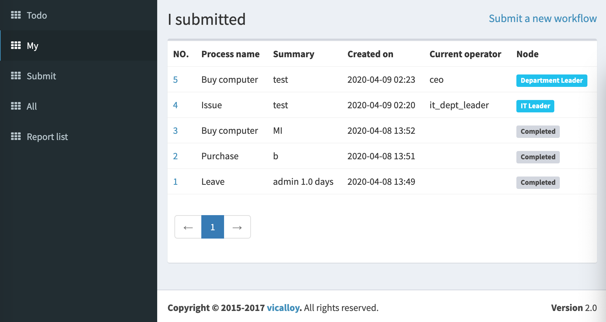
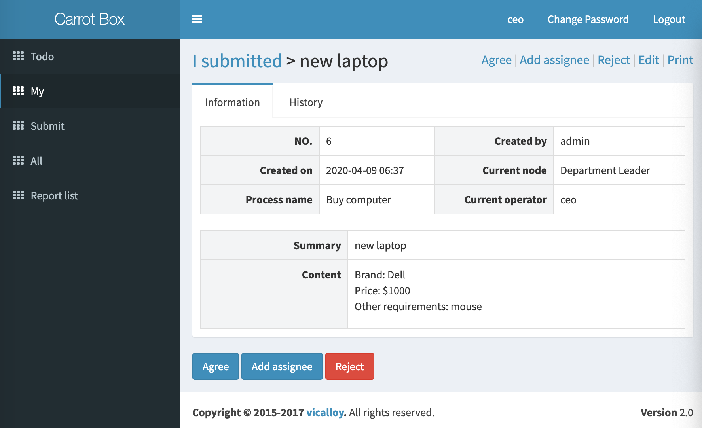
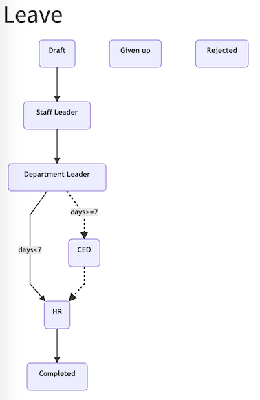

# Carrot Box

Carrot box is a workflow platform, it also an example of using [django-lb-workflow](https://github.com/vicalloy/django-lb-workflow/).

Demo site
---------

Demo site: http://wf.haoluobo.com/

username: ``admin`` password: ``password``

Switch to another user: http://wf.haoluobo.com/impersonate/search

Stop switch: http://wf.haoluobo.com/impersonate/stop

Running locally
---------------

Run the following commands:

    make init-pyenv
    make init
    make run

Creating Custom Workflows
-------------------------

You should read the documentation of [django-lb-workflow](https://github.com/vicalloy/django-lb-workflow/).
